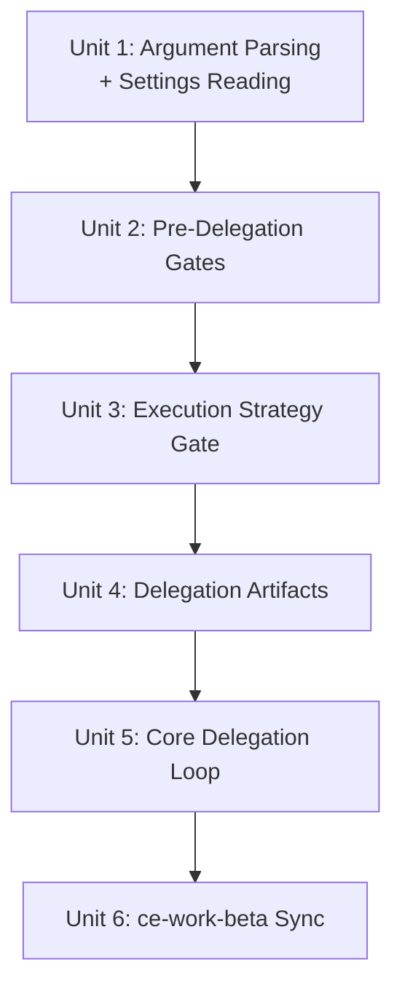

# feat: Add Codex delegation mode to ce:work

## Overview

Add an optional Codex delegation mode to ce:work that delegates code-writing to the Codex CLI (`codex exec`) using concrete bash templates. When active with a plan file, each implementation unit is sent to Codex with a structured prompt and result schema, then classified, verified, and committed or rolled back. This replaces ce-work-beta's prose-based delegation (PR #364) which caused non-deterministic CLI invocations.

> **Implementation note (2026-03-31):** The final rollout was redirected to `ce:work-beta` so stable `ce:work` remains unchanged during beta. `ce:work-beta` must be invoked manually; `ce:plan` and other workflow handoffs remain pointed at stable `ce:work` until promotion.

## Problem Frame

Users running ce:work from Claude Code (or other non-Codex agents) want to delegate token-heavy implementation work to Codex — either for better code quality or token conservation. PR #364's approach failed because the agent improvised CLI syntax each run. ce-work-beta has a structured 7-step External Delegate Mode with useful patterns (environment guards, circuit breaker), but the CLI invocation step itself is prose-based. This plan ports the structural patterns and replaces prose invocations with concrete, tested bash templates. (see origin: docs/brainstorms/2026-03-31-codex-delegation-requirements.md)

## Requirements Trace

- R1. Optional mode within ce:work, not separate skill; ce-work-beta superseded
- R2. Resolution chain: argument > local.md > hard default (off)
- R3-R4. `delegate:codex` / `delegate:local` canonical tokens with bounded imperative fuzzy matching
- R5. Plan-only delegation; per-unit eligibility pre-screening (out-of-repo checks, trivial-work exclusions)
- R6-R7. Environment guard (Codex sandbox detection); skill-level logic, no converter changes
- R8-R9. Availability check; no version gating
- R10-R13. One-time consent with sandbox mode selection during interactive ce:work execution
- R14. Concrete bash invocation template (validated via live CLI testing)
- R15. User-selected sandbox: `--yolo` (default) or `--full-auto`
- R16. Serial execution for all units; delegation and swarm mode mutually exclusive; delegated execution requires a clean working tree and rolls failed units back to `HEAD`
- R17. Prompt template written to `.context/compound-engineering/codex-delegation/`; XML-tagged sections
- R18. Circuit breaker: 3 consecutive failures -> standard mode fallback
- R19. Multi-signal failure classification (CLI fail / result absent / task fail / partial / verify fail / success)
- R20. `--output-schema` for structured result JSON; known gpt-5-codex model bug
- R21. Repo-root restriction via prompt constraint; complete-and-report on out-of-repo discovery
- R22. Settings in `.claude/compound-engineering.local.md`: `work_delegate`, `work_codex_consent`, `work_codex_sandbox`

## Scope Boundaries

- No app-server integration (bare `codex exec` only)
- No ad-hoc delegation (plan file required)
- No minimum version gating
- No periodic re-consent
- No converter changes
- No timeout for v1
- No out-of-repo detection (prompt constraint + pre-screening only)
- No automatic preservation of pre-existing dirty state in delegated mode
- Delegation and swarm mode (Agent Teams) are mutually exclusive

## Context & Research

### Relevant Code and Patterns

- `plugins/compound-engineering/skills/ce-work/SKILL.md` — target file; Phase 1 Step 4 (execution strategy, lines 126-144) and Phase 2 Step 1 (task loop, line ~159) are the insertion points
- `plugins/compound-engineering/skills/ce-work-beta/SKILL.md` — External Delegate Mode (lines 413-474) provides the structural pattern being ported (guards, circuit breaker, prompt file writing)
- `plugins/compound-engineering/skills/ce-review/SKILL.md` (lines 19-33) — canonical argument parsing pattern with token table, strip-before-interpret, conflict detection
- `plugins/compound-engineering/skills/ce-plan/SKILL.md` (lines 167-176, 352-356, 495) — current `Execution target: external-delegate` posture signal to remove as part of the supersession work
- `~/.claude/plugins/marketplaces/cli-printing-press/skills/printing-press/SKILL.md` — proven codex delegation via `codex exec --yolo -` with 3-failure circuit breaker
- `~/.claude/plugins/marketplaces/openai-codex/plugins/codex/skills/gpt-5-4-prompting/` — Codex prompt best practices: XML-tagged blocks, `<completeness_contract>`, `<verification_loop>`, `<action_safety>`

### Institutional Learnings

- **Git workflow skills need explicit state machines** (`docs/solutions/skill-design/git-workflow-skills-need-explicit-state-machines-2026-03-27.md`): Re-read state at each git transition; use `git status` not `git diff HEAD` for cleanliness; model non-zero exits as state transitions
- **Pass paths, not content, to sub-agents** (`docs/solutions/skill-design/pass-paths-not-content-to-subagents-2026-03-26.md`): Orchestrator discovers paths; sub-agent reads content; instruction phrasing affects tool call count
- **Beta promotion must update callers atomically** (`docs/solutions/skill-design/beta-promotion-orchestration-contract.md`): When adding new invocation semantics, update all callers in the same PR
- **Compound-refresh mode detection** (`docs/solutions/skill-design/compound-refresh-skill-improvements.md`): Mode must be explicit opt-in via arguments, not auto-detected from environment

## Key Technical Decisions

- **Insertion point:** Delegation routing gate at Phase 1 Step 4 (execution strategy selection); per-unit delegation branch at Phase 2 Step 1 line ~159 ("Implement following existing conventions"). This keeps delegation as a task-level modifier within the existing execution flow rather than a separate phase.
- **Argument parsing pattern:** Follow ce:review's canonical pattern — token table, strip-before-interpret, graceful fallback. Introduce `delegate:` as a new namespace separate from `mode:`. Do not add a non-interactive mode to ce:work as part of this feature; the skill remains interactive. The `argument-hint` frontmatter gets updated.
- **Fuzzy matching boundary:** Support fuzzy activation only for imperative execution-intent phrases such as "use codex", "delegate to codex", or "codex mode". A bare mention of "codex" or prompts about Codex itself must not activate delegation.
- **Prompt template format:** XML-tagged blocks following the codex `gpt-5-4-prompting` skill's guidance — `<task>`, `<files>`, `<patterns>`, `<approach>`, `<constraints>`, `<verify>`, `<output_contract>`. This is more structured than printing-press's flat format and aligns with how Codex/GPT-5.4 models parse instructions.
- **Settings parsing:** No utility exists. The skill includes inline instructions for the agent to read `.claude/compound-engineering.local.md`, extract YAML between `---` delimiters, and interpret keys. For writing, read-modify-write with explicit handling: (1) if file doesn't exist, create it with YAML frontmatter wrapper; (2) if file exists with valid frontmatter, merge new keys preserving existing keys; (3) if file exists without frontmatter or with malformed frontmatter, prepend a valid frontmatter block and preserve existing body content below the closing `---`. Cross-platform path rewriting handled by converters (`.claude/` -> `.codex/` -> `.opencode/`).
- **Circuit breaker resets on success, persists across units:** A successful delegation resets the counter to 0. Consecutive failures accumulate across units within a single plan execution. If delegation keeps failing, it's likely environmental (codex auth, model issues), not unit-specific.
- **Delegation takes precedence over swarm:** When delegation is active, serial execution is enforced and swarm mode is suppressed. This applies even when slfg or the user explicitly requests swarm mode. Delegation is the higher-priority execution constraint because it requires serial execution. Swarm mode may be re-evaluated in the future but delegation support is more important now.
- **Delegated execution safety model:** Do not auto-stash pre-existing user changes. Delegated execution only starts from a clean working tree in the current checkout or current worktree. If the tree is dirty, stop and tell the user to commit, stash explicitly, or continue in standard mode. This makes rollback-to-`HEAD` safe and avoids hiding user data inside automation-owned stash entries.
- **Partial result policy:** Treat `status: "partial"` as a handoff, not a completed unit. Keep the diff, switch immediately to local completion for that same unit, verify and commit before moving on, and count it toward the circuit breaker. If local completion fails, roll the unit back to `HEAD`.
- **ce-work-beta disposition:** Port Frontend Design Guidance (lines 266-272) to ce:work as a separate Phase 2 addition. Supersede the External Delegate Mode section entirely, and remove the old `Execution target: external-delegate` execution-note contract from ce:plan / ce-work-beta in the same PR. Keep ce-work-beta otherwise intact for now — deletion is a separate cleanup task.

## Open Questions

### Resolved During Planning

- **Optimal prompt template structure (R17):** XML-tagged blocks per codex `gpt-5-4-prompting` guidance. Sections: `<task>`, `<files>`, `<patterns>`, `<approach>`, `<constraints>` (includes repo-root restriction and mandatory result reporting), `<verify>`, `<output_contract>`.
- **Insertion point in ce:work Phase 2 (R14):** Phase 1 Step 4 for routing/strategy gate; Phase 2 Step 1 line ~159 for per-unit delegation branch.
- **Circuit breaker reset semantics (R18):** Per-plan, resetting to 0 on success. Rationale: repeated failures are likely environmental, not unit-specific.
- **How to parse local.md YAML (R22):** Inline skill instructions — agent reads the file, extracts YAML between `---` delimiters, interprets the keys. No utility exists; building a general-purpose utility is out of scope.
- **Fallback when --output-schema fails (R20):** If result JSON is absent or malformed, classify as task failure per R19. The agent proceeds to the next unit or triggers the circuit breaker.

### Deferred to Implementation

- **Exact prompt wording:** The XML-tagged template structure is defined; the exact prose within each section will be refined during implementation based on testing with representative plan units.
- **Consent flow UX copy:** The consent warning content (R10) — what exactly to say about `--yolo`, how to present the sandbox choice — is best refined during implementation with real interaction testing.
- **Frontend Design Guidance port quality:** Whether the beta's Frontend Design Guidance section ports cleanly or needs adaptation for ce:work's structure.

## High-Level Technical Design

> *This illustrates the intended approach and is directional guidance for review, not implementation specification. The implementing agent should treat it as context, not code to reproduce.*

The delegation mode adds three sections to ce:work's SKILL.md:

```
┌─────────────────────────────────────────────────────────────┐
│ SKILL.md Structure (additions marked with +)                │
├─────────────────────────────────────────────────────────────┤
│                                                             │
│ + ## Argument Parsing                                       │
│   Parse delegate:codex / delegate:local tokens              │
│   Read local.md for work_delegate fallback                  │
│   Resolve delegation state: on/off + sandbox mode           │
│                                                             │
│   ## Phase 0: Input Triage (existing)                       │
│                                                             │
│   ## Phase 1: Quick Start (existing)                        │
│   + Step 4 modification: if delegation on + plan present,   │
│     force serial execution, block swarm mode                │
│                                                             │
│   ## Phase 2: Execute (existing)                            │
│   + Step 1 modification: if delegation on for this unit,    │
│     branch to Codex Delegation section instead of           │
│     "implement following existing conventions"              │
│                                                             │
│ + ## Codex Delegation Mode                                  │
│   + Pre-delegation checks (env guard, availability,         │
│     consent)                                                │
│   + Prompt template builder (XML-tagged)                    │
│   + Result schema definition                                │
│   + Execution loop (exec -> classify ->                     │
│     local-complete/commit/rollback-to-HEAD)                 │
│   + Circuit breaker logic                                   │
│                                                             │
│   ## Phase 3: Quality Check (existing, unchanged)           │
│   ## Phase 4: Ship It (existing, unchanged)                 │
│   ## Swarm Mode (existing, + mutual exclusion note)         │
│                                                             │
│ + ## Frontend Design Guidance (ported from ce-work-beta)    │
│                                                             │
└─────────────────────────────────────────────────────────────┘
```

## Implementation Units



---

- [x] **Unit 1: Argument Parsing and Settings Reading**

**Goal:** Add `delegate:codex` / `delegate:local` token parsing to ce:work and the resolution chain that reads local.md settings.

**Requirements:** R2, R3, R4, R22

**Dependencies:** None

**Files:**
- Modify: `plugins/compound-engineering/skills/ce-work/SKILL.md`
- Test: `tests/pipeline-review-contract.test.ts`
- Test: manual invocation testing with `delegate:codex`, `delegate:local`, and fuzzy variants

**Approach:**
- Add an `## Argument Parsing` section immediately before the `## Phase 0: Input Triage` heading (after the opening narrative), following ce:review's canonical pattern (token table, strip-before-interpret). Cross-reference the High-Level Technical Design diagram for placement.
- Token table: `delegate:codex` (activate), `delegate:local` (deactivate), plus bounded fuzzy recognition for delegate activation phrases. Do not add `mode:headless` here; ce:work remains an interactive workflow.
- After token extraction, read `.claude/compound-engineering.local.md` for `work_delegate`, `work_codex_consent`, `work_codex_sandbox` keys
- Implement resolution chain: argument flag > local.md `work_delegate` > hard default `false`
- Store resolved delegation state (on/off) and sandbox mode in skill-level variables for downstream consumption
- Update the `argument-hint` frontmatter to include `delegate:codex` for discoverability
- Follow learning: mode must be explicit opt-in via arguments, not auto-detected (compound-refresh pattern)

**Patterns to follow:**
- `plugins/compound-engineering/skills/ce-review/SKILL.md` lines 19-33 — token table, strip-before-interpret, conflict detection
- `plugins/compound-engineering/skills/ce-compound-refresh/SKILL.md` line 13 — simple token stripping
- YAML frontmatter parsing: agent reads file, extracts content between `---` delimiters, interprets keys

**Test scenarios:**
- Happy path: `delegate:codex` in arguments sets delegation on with default yolo sandbox
- Happy path: `delegate:local` in arguments sets delegation off even when local.md has `work_delegate: codex`
- Happy path: No delegate token with `work_delegate: codex` in local.md activates delegation
- Happy path: No delegate token and no local.md setting defaults to delegation off
- Edge case: `delegate:codex` combined with a plan file path — both are parsed correctly, plan path preserved
- Edge case: Fuzzy variant "use codex for this work" recognized as delegation activation
- Edge case: Bare prompt "fix codex converter bugs" does not activate delegation
- Edge case: Missing or empty local.md file — falls back to hard defaults gracefully
- Edge case: Malformed YAML frontmatter in local.md — treated as if settings are absent, not a fatal error

**Verification:**
- Delegation state resolves correctly for all combinations of argument + local.md + default
- Plan file paths are not corrupted by token stripping
- Argument-hint frontmatter includes delegate:codex
- Contract tests cover the new token/wording expectations

---

- [x] **Unit 2: Pre-Delegation Gates (Environment Guard + Availability + Consent)**

**Goal:** Add the checks that run before delegation can proceed — environment detection, CLI availability, and one-time consent with sandbox mode selection.

**Requirements:** R6, R7, R8, R10, R11, R12, R13

**Dependencies:** Unit 1 (delegation state must be resolved)

**Files:**
- Modify: `plugins/compound-engineering/skills/ce-work/SKILL.md`
- Test: `tests/pipeline-review-contract.test.ts`
- Test: manual invocation testing in Codex sandbox vs normal environment

**Approach:**
- Add a `### Pre-Delegation Checks` subsection within the new Codex Delegation Mode section
- **Environment guard:** Check `$CODEX_SANDBOX` and `$CODEX_SESSION_ID`. If set, disable delegation. Notify only when user explicitly requested delegation (via argument); proceed silently when delegation was enabled via local.md default only.
- **Availability check:** `command -v codex`. If not found, fall back to standard mode with notification.
- **Consent flow:** If `work_codex_consent` is not `true` in local.md:
  - Show one-time warning explaining `--yolo`, present sandbox mode choice (yolo recommended, full-auto option), record decision to local.md
- **Consent decline path:** Ask whether to disable delegation entirely; if yes, set `work_delegate: false` in local.md
- Follow learning: re-read git/file state at each transition rather than caching (state machine pattern)

**Patterns to follow:**
- ce-work-beta External Delegate Mode lines 436-445 — environment guard structure
- Platform-agnostic tool references: "Use the platform's blocking question tool (AskUserQuestion in Claude Code, request_user_input in Codex)"

**Test scenarios:**
- Happy path: Outside Codex, CLI available, consent already granted — proceeds to delegation
- Happy path: First-time consent flow — warning shown, user accepts yolo, settings written to local.md
- Happy path: First-time consent — user chooses full-auto, setting stored correctly
- Error path: Inside Codex sandbox with explicit `delegate:codex` argument — notification emitted, falls back to standard mode
- Error path: Inside Codex sandbox with only local.md default — silent fallback, no notification
- Error path: `codex` CLI not on PATH — notification emitted, falls back to standard mode
- Error path: User declines consent — asked about disabling, if yes `work_delegate: false` set
- Edge case: Delegation enabled via local.md default on first invocation (no delegate:codex argument) — consent flow shown as normal, because R10 triggers on "first time delegation activates" regardless of activation source

**Verification:**
- Environment guard correctly detects Codex sandbox and falls back
- Missing codex CLI produces notification and graceful fallback
- Consent state persists across invocations via local.md
- Consent flow prompts only within ce:work's existing interactive execution model

---

- [x] **Unit 3: Execution Strategy Gate and Swarm Exclusion**

**Goal:** Modify Phase 1 Step 4 to force serial execution when delegation is active and block swarm mode selection.

**Requirements:** R5, R16

**Dependencies:** Unit 1 (delegation state)

**Files:**
- Modify: `plugins/compound-engineering/skills/ce-work/SKILL.md`
- Test: `tests/pipeline-review-contract.test.ts`
- Test: manual testing with delegation + swarm mode request

**Approach:**
- In Phase 1 Step 4 ("Choose Execution Strategy"), add a routing gate: if delegation is active AND a plan file is present, override the strategy to serial execution
- Add explicit note that delegation mode and swarm mode (Agent Teams) are mutually exclusive
- **Delegation takes precedence over swarm mode.** When delegation is active (resolved via the resolution chain in Unit 1), serial execution is enforced and swarm mode is suppressed — even if the user or caller (e.g., slfg) requests swarm mode. Delegation requires serial execution which is mechanically incompatible with swarm. If swarm mode would otherwise activate but delegation is on, emit a notification: "Delegation mode active — serial execution enforced, swarm mode unavailable." This gate operates at the execution-strategy level (Phase 1 Step 4), after argument parsing completes.
- Add a brief note in the Swarm Mode section about the mutual exclusivity constraint
- Enforce plan-only delegation: if delegation is active but no plan file was provided (bare prompt), fall back to standard mode with a brief note

**Patterns to follow:**
- Existing Phase 1 Step 4 execution strategy decision tree
- Beta promotion learning: when adding new invocation semantics, update all callers atomically

**Test scenarios:**
- Happy path: Delegation active with plan file — serial execution enforced
- Happy path: Delegation off — existing execution strategy selection unchanged
- Edge case: Delegation active but bare prompt (no plan) — falls back to standard mode
- Edge case: slfg requests swarm mode but local.md has `work_delegate: codex` — delegation wins, serial execution enforced, swarm mode suppressed with notification
- Edge case: User explicitly passes `delegate:codex` AND requests swarm mode — delegation wins, swarm suppressed with notification

**Verification:**
- Serial execution enforced when delegation active with a plan
- Swarm mode suppressed when delegation is active, with notification
- Bare prompts always use standard mode regardless of delegation setting
- slfg invocations with delegation enabled via local.md result in serial execution, not swarm mode

---

- [x] **Unit 4: Delegation Artifacts (Prompt Template + Result Schema)**

**Goal:** Define the prompt template builder and result schema that are written to `.context/compound-engineering/codex-delegation/` before each delegation invocation.

**Requirements:** R17, R20, R21

**Dependencies:** Unit 2 (consent + sandbox mode resolved)

**Files:**
- Modify: `plugins/compound-engineering/skills/ce-work/SKILL.md`
- Test: manual inspection of generated prompt files and schema

**Approach:**
- Add a `### Prompt Template` subsection within the Codex Delegation Mode section
- Define the XML-tagged prompt structure following `gpt-5-4-prompting` best practices:
  - `<task>` — goal from implementation unit
  - `<files>` — file list from implementation unit
  - `<patterns>` — relevant code context (CURRENT PATTERNS)
  - `<approach>` — approach from implementation unit
  - `<constraints>` — no git commit, repo-root restriction, scoped changes, line limit, mandatory result reporting
  - `<verify>` — test/lint commands from project
  - `<output_contract>` — the result reporting instructions (status/files_modified/issues/summary)
- Define the result schema JSON (per R20) as a static file written to `.context/compound-engineering/codex-delegation/result-schema.json`
- Include `.context/compound-engineering/codex-delegation/` directory creation as part of the setup contract
- Prompt files: `prompt-<unit-id>.md` — cleaned up after each successful unit
- Result files: `result-<unit-id>.json` — cleaned up after each successful unit
- Follow learning: pass paths, not content, to sub-agents — the prompt template includes file paths for CURRENT PATTERNS, letting codex read them

**Patterns to follow:**
- `gpt-5-4-prompting` skill — XML-tagged blocks, `<completeness_contract>`, `<action_safety>`
- Printing-press skill — TASK/FILES TO MODIFY/CURRENT CODE/EXPECTED CHANGE/CONVENTIONS/CONSTRAINTS/VERIFY structure
- AGENTS.md scratch space convention: `.context/compound-engineering/<workflow-or-skill-name>/`

**Test scenarios:**
- Happy path: Prompt file generated with all XML sections populated from a plan implementation unit
- Happy path: Result schema file created as valid JSON matching the R20 schema definition
- Edge case: Implementation unit with no VERIFY commands — `<verify>` section contains fallback instruction ("Run any available test suite or lint")
- Edge case: Implementation unit with no CURRENT PATTERNS — `<patterns>` section notes the absence rather than being empty
- Integration: Prompt file is readable by `codex exec - < prompt-file.md` — validated during brainstorm CLI testing

**Verification:**
- Generated prompt files contain all required XML sections
- Result schema validates against the JSON schema definition in R20
- Scratch directory created at `.context/compound-engineering/codex-delegation/`
- Files cleaned up after successful delegation

---

- [x] **Unit 5: Core Delegation Execution Loop**

**Goal:** Implement the per-unit delegation execution: clean-baseline preflight, codex exec invocation, result classification, commit or rollback-to-`HEAD`, and circuit breaker.

**Requirements:** R14, R15, R16, R18, R19

**Dependencies:** Unit 3 (serial execution enforced), Unit 4 (prompt template + schema available)

**Files:**
- Modify: `plugins/compound-engineering/skills/ce-work/SKILL.md`
- Test: `tests/pipeline-review-contract.test.ts`
- Test: manual end-to-end delegation testing with a real plan file

**Approach:**
- Add the `### Execution Loop` subsection within Codex Delegation Mode
- **Clean-baseline preflight:** Before the first delegated unit, require a clean working tree in the current checkout/worktree (`git status --short` empty). If dirty, stop and instruct the user to commit, stash explicitly, or continue in standard mode. Do not auto-stash user changes.
- **Per-unit eligibility check (R5):** Before delegating, the agent assesses whether the unit is eligible per R5: (a) does not require modifications outside the repository root, and (b) is not trivially small (single-file config change, simple substitution where delegation overhead exceeds the work). If ineligible, execute locally in standard mode and state the reason before execution.
- **Codex exec invocation:** The verbatim bash template from R14:
  ```
  codex exec $SANDBOX_FLAG --output-schema <schema-path> -o <result-path> - < <prompt-path>
  ```
- **Result classification (R19):** Multi-signal approach:
  1. Exit code != 0 → CLI failure → rollback current unit to `HEAD`, then hard fall back to standard mode for all remaining units
  2. Exit code 0, result JSON missing/malformed → task failure → rollback current unit to `HEAD` + circuit breaker
  3. `status: "failed"` → task failure → rollback current unit to `HEAD` + circuit breaker
  4. `status: "partial"` → keep the diff, switch immediately to standard-mode completion for this same unit, verify + commit before moving on, count as a delegation failure for circuit-breaker purposes
  5. `status: "completed"` + VERIFY fails → verify failure → rollback current unit to `HEAD` + circuit breaker
  6. `status: "completed"` + VERIFY passes → success → commit
- **Rollback:** `git checkout -- . && git clean -fd` back to `HEAD`. This is only permitted because delegated mode starts from a clean baseline and never auto-stashes user-owned local changes.
- **Commit on success:** Mandatory commit after each successful unit (enforces clean working tree for next unit)
- **Circuit breaker (R18):** Counter persists across units within a plan execution. Resets to 0 on success. After 3 consecutive failures, fall back to standard mode for all remaining units with notification.
- **Partial success handling:** `partial` is a local handoff for the current unit, not permission to continue with a dirty tree. The main agent must finish the same unit locally, verify it, and commit before dispatching the next unit. If local completion fails, roll the unit back to `HEAD`.

**Patterns to follow:**
- ce-work-beta External Delegate Mode 7-step workflow (lines 447-465)
- Printing-press skill codex invocation + circuit breaker pattern
- Git state machine learning: re-read state at each transition; model non-zero exits as expected state transitions

**Test scenarios:**
- Happy path: Unit delegated, codex succeeds, result schema says "completed", VERIFY passes — changes committed
- Happy path: Delegation runs inside an already-isolated clean worktree — no extra worktree required
- Happy path: Multiple units delegated serially — each starts with clean working tree after prior commit
- Happy path: Circuit breaker resets after a success following a failure
- Error path: Dirty working tree before first delegated unit — stop and ask the user to clean/stash/commit or continue in standard mode
- Error path: codex exec returns exit code != 0 — classified as CLI failure, rollback to `HEAD`, all remaining units use standard mode
- Error path: Result JSON missing after successful exit code — classified as task failure, rollback to `HEAD`, circuit breaker increment
- Error path: Result schema reports "failed" — rollback to `HEAD`, circuit breaker increment
- Error path: Result schema reports "completed" but VERIFY fails — rollback to `HEAD`, circuit breaker increment
- Error path: 3 consecutive failures — circuit breaker triggers, remaining units fall back to standard mode with notification
- Edge case: Result schema reports "partial" — changes kept, same unit completed locally, verified, and committed before the next unit
- Edge case: Unit pre-screened as ineligible (out-of-repo) — executed locally, not delegated
- Edge case: Unit pre-screened as trivially small — executed locally, not delegated
- Integration: Contract tests assert the delegated-mode clean-baseline and supersession wording stays in sync

**Verification:**
- Delegation produces deterministic CLI invocations (no agent improvisation)
- Failed delegation rolls back cleanly to `HEAD` without touching pre-existing user changes
- Circuit breaker activates after 3 consecutive failures
- Partial success never advances to the next unit until the current unit is completed locally and committed
- Each successful delegation is followed by a commit before the next unit

---

- [x] **Unit 6: ce-work-beta Sync (Port Non-Delegation Features + Supersede)**

**Goal:** Port ce-work-beta's Frontend Design Guidance to ce:work, mark the old delegation section as superseded, and remove the obsolete `external-delegate` execution-note contract.

**Requirements:** R1

**Dependencies:** Unit 5 (delegation fully implemented in ce:work)

**Files:**
- Modify: `plugins/compound-engineering/skills/ce-work/SKILL.md`
- Modify: `plugins/compound-engineering/skills/ce-work-beta/SKILL.md`
- Modify: `plugins/compound-engineering/skills/ce-plan/SKILL.md`
- Test: `tests/pipeline-review-contract.test.ts`
- Test: verify Frontend Design Guidance triggers correctly in ce:work

**Approach:**
- **Port Frontend Design Guidance** (ce-work-beta lines 266-272) to ce:work Phase 2 as a new numbered step: "For UI tasks without Figma designs, load the `frontend-design` skill before implementing"
- **Supersede ce-work-beta delegation:** Add a note at the top of ce-work-beta's External Delegate Mode section stating it is superseded by ce:work's Codex Delegation Mode. Do not delete the section — leave it as documentation of the prior approach.
- **Remove obsolete execution-note contract:** Delete `Execution target: external-delegate` guidance and examples from ce:plan, and remove ce-work-beta's activation path that consumes that tag. After this change, delegation is controlled by the ce:work resolution chain only.
- **Mixed-Model Attribution:** Port the PR attribution guidance (ce-work-beta lines 467-473) to ce:work's Codex Delegation Mode section — when some tasks are delegated and some local, the PR should credit both models.
- **Caller update check:** Verify no other skills still reference `Execution target: external-delegate` after the removal. Per the beta promotion learning, delete the old contract atomically rather than leaving dual semantics behind.

**Patterns to follow:**
- ce-work-beta Frontend Design Guidance (lines 266-272)
- ce-work-beta Mixed-Model Attribution (lines 467-473)
- Beta promotion learning: update orchestration callers atomically

**Test scenarios:**
- Happy path: UI task without Figma design in ce:work — Frontend Design Guidance triggers correctly
- Happy path: Mixed delegation/local execution — PR attribution credits both models
- Happy path: ce:plan no longer emits `Execution target: external-delegate`
- Edge case: ce-work-beta invoked directly — sees supersession note, delegation section still present for reference

**Verification:**
- Frontend Design Guidance is functional in ce:work Phase 2
- ce-work-beta delegation section is marked superseded
- `external-delegate` references are removed from live skills
- `bun test` and `bun run release:validate` pass because skill content changed

## System-Wide Impact

- **Interaction graph:** ce:work's Phase 2 task execution loop gains a delegation branch. Phase 1 Step 4 gains a routing gate. The Swarm Mode section gains a mutual exclusivity note. Phase 3 is unchanged. Phase 4 only gains mixed-model attribution guidance carried over from ce-work-beta.
- **Error propagation:** CLI failures cause rollback of the current delegated unit to `HEAD` and hard fallback to standard mode for all remaining units. Task/verify failures count toward the circuit breaker and trigger per-unit rollback. Partial success is a handoff path: finish the same unit locally, then commit before continuing.
- **State lifecycle risks:** Delegated mode now refuses to start from a dirty tree, including in an existing worktree checkout. This is a deliberate safety tradeoff that avoids automation-owned stash state and keeps `HEAD` rollback safe. The mandatory commit after each successful or locally-completed partial unit prevents cross-unit entanglement.
- **API surface parity:** `delegate:codex` is the new argument namespace. Converters rewrite `.claude/` paths in local.md references to platform equivalents (`.codex/`, `.opencode/`). The old `Execution target: external-delegate` contract is removed from live skills. No new ce:work-wide non-interactive mode is introduced.
- **Integration coverage:** The delegation flow crosses ce:work -> bash (codex exec) -> codex CLI -> file system (result JSON, prompt files) -> git. End-to-end testing requires a working codex CLI installation.
- **Unchanged invariants:** ce:work's existing argument handling for file paths and bare prompts is preserved. Users who never enable delegation experience zero behavioral change. Phase 3 remains unchanged; Phase 4 keeps its existing ship flow aside from mixed-model attribution guidance.

## Risks & Dependencies

| Risk | Mitigation |
|------|------------|
| `--output-schema` only works with gpt-5 family models (bug #4181) | Document the model constraint; classify absent/malformed result JSON as task failure |
| Codex CLI flags change in future releases | Invocation is one concrete bash line — loud failure, easy to fix |
| Delegated mode stops on dirty trees, which may feel stricter than standard mode | Be explicit in the prompt: current checkout/worktree is fine, but it must be clean before delegated execution begins |
| Consent flow complexity in a skill that has no prior interactive prompting | Follow ce:review's pattern for platform-agnostic question tool usage |
| local.md YAML parsing has no utility — agent must parse inline | Provide clear parsing instructions; malformed YAML treated as absent (graceful degradation) |
| slfg interaction: swarm mode suppressed when delegation active | Delegation takes precedence; serial execution enforced. slfg users with delegation enabled will not get swarm mode — emit notification |
| `partial` results could otherwise leave the loop in an ambiguous state | Treat `partial` as local handoff for the same unit, require verify + commit before moving on, and count it toward the circuit breaker |

## Sources & References

- **Origin document:** [docs/brainstorms/2026-03-31-codex-delegation-requirements.md](docs/brainstorms/2026-03-31-codex-delegation-requirements.md)
- Related PR: #364 (ce-work-beta sandbox options — superseded)
- Related PR: #363 (ce-work-beta original delegation — superseded)
- Codex prompting: `~/.claude/plugins/marketplaces/openai-codex/plugins/codex/skills/gpt-5-4-prompting/`
- Printing-press pattern: `~/.claude/plugins/marketplaces/cli-printing-press/skills/printing-press/SKILL.md`
- Git state machine learning: `docs/solutions/skill-design/git-workflow-skills-need-explicit-state-machines-2026-03-27.md`
- Beta promotion learning: `docs/solutions/skill-design/beta-promotion-orchestration-contract.md`
- Pass paths learning: `docs/solutions/skill-design/pass-paths-not-content-to-subagents-2026-03-26.md`
